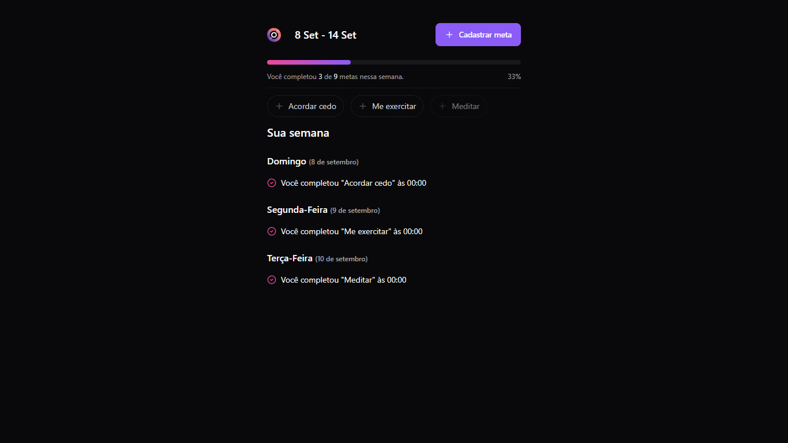

# Node + TypeScript + Fastify + Postgres + Drizzle + Biome + Docker

Adicione atividades que te fazem bem e que você quer continuar
praticando toda semana.

<p align="center">
  
</p>

<h1 align="center">
	
</h1>

## 🧪 Tecnologias

Esse projeto foi desenvolvido com as seguintes tecnologias:

- [Node](https://nodejs.org/en/)
- [TypeScript](https://www.typescriptlang.org/)
- [Fastify](https://fastify.dev/)
- [Drizzle](https://orm.drizzle.team/)
- [Postgres](https://www.postgresql.org/)
- [Biome](https://biomejs.dev/)
- [Docker](https://www.docker.com/)

Para mais detalhes, veja o **[package.json](./package.json)**.

## 🚀 Como executar

Como pré-requisitos, é necessário instalar o [Node](https://nodejs.org/en/) e o [Yarn](https://classic.yarnpkg.com/en/docs/install/) em suas versões LTS.

Cumprindo os pré-requisitos, clone o projeto e acesse a pasta clonada.

```bash
$ git clone https://github.com/aleessandrohr/nlw-pocket-backend
$ cd nlw-pocket-backend
```

Para iniciá-lo, siga os passos abaixo:

```bash
# Instalar as dependências
$ bun

# Iniciar o Banco de Dados
$ bun docker:start

# Gerar as migrations
$ bun db:generate

# Rodar as migrations
$ bun db:migrate

# Adicionar dados iniciais no Banco de Dados (opcional)
$ bun seed

# Buildar o projeto
$ bun run build

# Iniciar o projeto
$ bun start
```

O app estará disponível no seu browser pelo endereço [http://localhost:3333](http://localhost:3333).

## 💻 Projeto Inicial

Adicione atividades que te fazem bem e que você quer continuar
praticando toda semana.

Este é um projeto desenvolvido durante a **[Next Level Week Together](https://nextlevelweek.com/)**, apresentada dos dias 09 a 12 de setembro de 2024.

## Projeto Estendido

- Adicionado sistema de auth com refresh token e multiple sessions

## 🔖 Layout

Você pode visualizar o layout do projeto através do link abaixo:

- [Layout Web](https://www.figma.com/community/file/1415093862269754302/nlw-pocket-js-in-orbit)

Lembrando que você precisa ter uma conta no [Figma](https://figma.com/).

## 📝 License

Esse projeto está sob a licença MIT. Veja o arquivo [LICENSE](./LICENSE) para mais detalhes.

---
